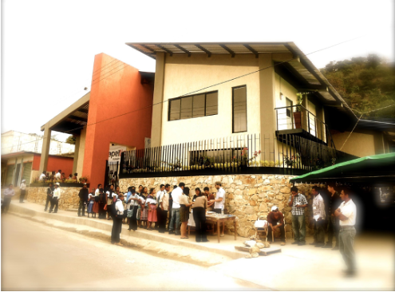
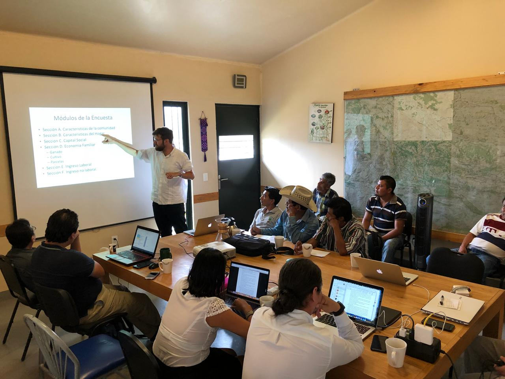
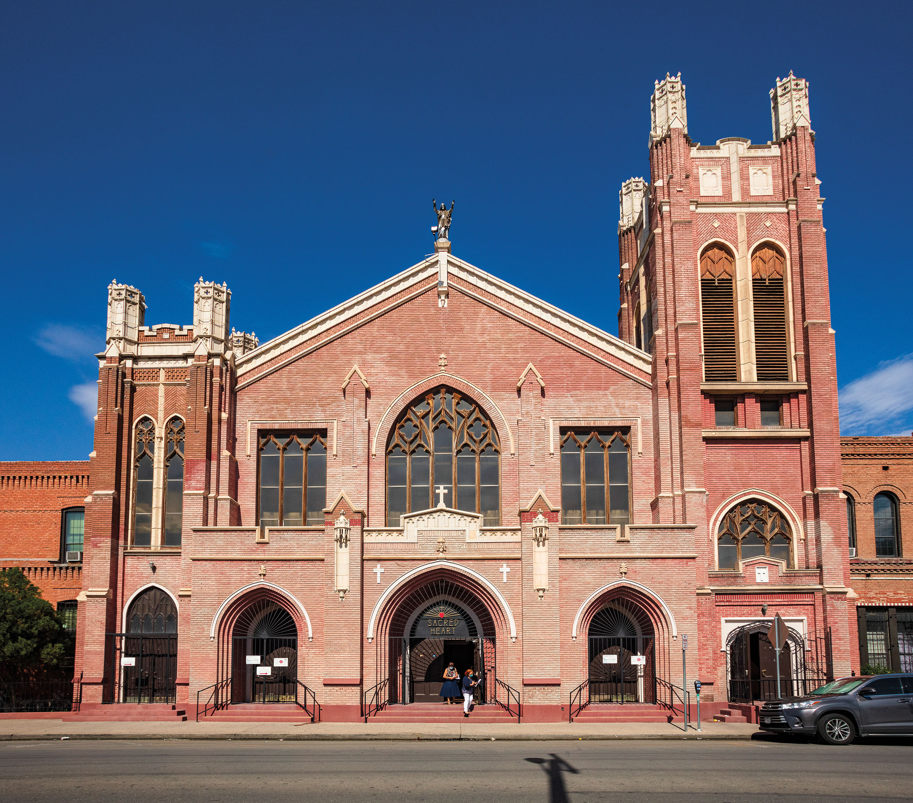
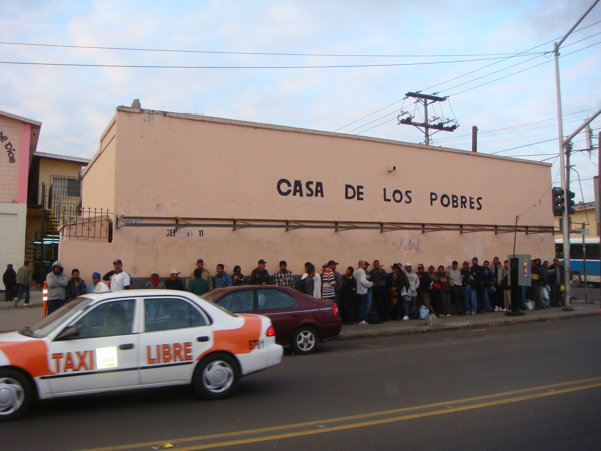
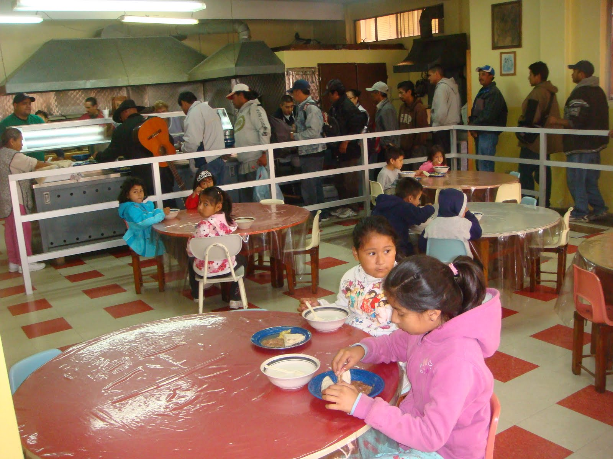

## Chiapas (2017-present)
Since 2017, I have worked with the [Capeltic](http://www.capeltic.org) coffee cooperative in Chiapas, Mexico, affiliated with the [Mexican province](https://jesuitasmexico.org/) of the Society of Jesus. Capeltic is a producer-owned cooperative of Tseltal indigenous coffee farmers in northern Chiapas, operating within [Yomol A'tel](https://www.yomolatel.org/), a network of solidarity-economy enterprises.

From 2017-18, I supervised the first [household surveys](datasets.html) conducted in the region and used them as the basis of my [master's thesis](https://repository.usfca.edu/thes/1079/). In summer 2022, I returned to supervise a lab-in-the-field experiment that became the basis of my job market paper, [Unpacking Side-Selling](http://doi.org/10.1111/agec.70051).

In addition, I have brought faculty, staff, and students from Jesuit institutions to visit Chiapas on numerous occasions. Working with the [Ignatian Solidarity Network](https://ignatiansolidarity.net/) and [EthixMerch](https://ethixmerch.com/), I helped Capeltic begin distributing its coffee in the United States for the first time via an [online store](https://shop.ignatiansolidarity.net/products/capeltic-origin-roasted-gourmet-coffee-2-20-lbs-1-kg?variant=40557750452313). I am particularly proud of the work we have done with the [Ignatian Center](https://www.scu.edu/ic/) of Santa Clara University in developing a partnership between SCU and Capeltic that has resulted in two student immersion trips and the sale of Capeltic coffee on the SCU campus.

::: {layout-ncol=2}

:::

Here are some
[Chiapas Fieldwork Photos](chiapas_fieldwork_photos.html) from
the fieldwork we did in 2022.

Over the years, various people have written articles about my
relationship with Capeltic.

* [Capeltic Coffee Launch Event at Santa Clara University - October 2025](https://www.youtube.com/watch?v=ZWNUUM2jvv0)
* [Students support indigenous farmers through a collaboration with Capeltic coffee - September 2025](https://www.scu.edu/news-and-events/feature-stories/2025-feature-stories/stories/students-support-indigenous-farmers-through-a-collaboration-with-capeltic-coffee.html)
* [Visit to coffee plant - January 2024](https://ignatiansolidarity.net/blog/2024/03/06/coffee-catholic-social-teaching-delegation-visits-jesuit-supported-coffee-cooperative-in-mexico/)
* [Initial story about visiting the coffee plant - July 2019](https://www.jesuitscentralsouthern.org/stories/capeltic-coffee-collaborative-turning-coffee-into-hope/)
* [American Magazine article about Capeltic - March 2019](https://www.americamagazine.org/politics-society/2019/03/29/whats-your-cup-coffee-capeltic-chiapas-based-cooperative-serving)

## El Paso (2018-2020)
From 2018-2020, I was the Director of Religious Formation at [Sacred Heart Church](https://www.sacredheartelpaso.org/),
which is four blocks from the US/Mexico border. Here I first started thinking about the way that internal migrants help each other find jobs in the local manufacturing (maquila) industry that prompted the questions I address in [my work](research.html) on the transition into wage employment. A [recent article](https://texashighways.com/culture/the-church-at-the-heart-of-el-pasos-segundo-barrio/) gives
more background about the Segundo Barrio Neighborhood.

::: {layout-ncol=2}

:::

## Tijuana (Spring 2008)
As a Jesuit novice, in spring 2008, I worked at the [Casa de los Pobres](https://casadelospobresusa.com/)
in Tijuana, Baja California, Mexico. There I began to learn Spanish as I served food to migrants
every day and listened to their stories.

::: {layout-ncol=2}

:::

